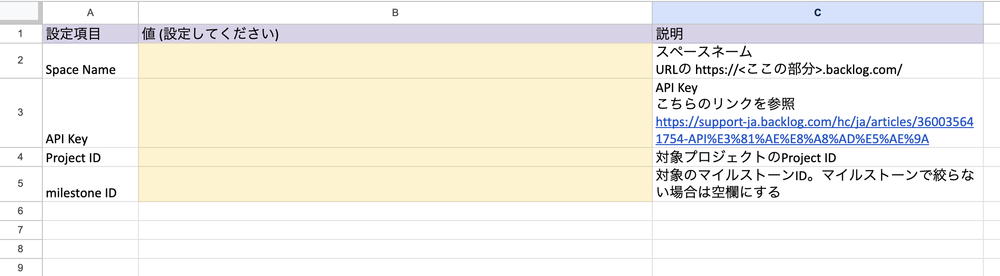
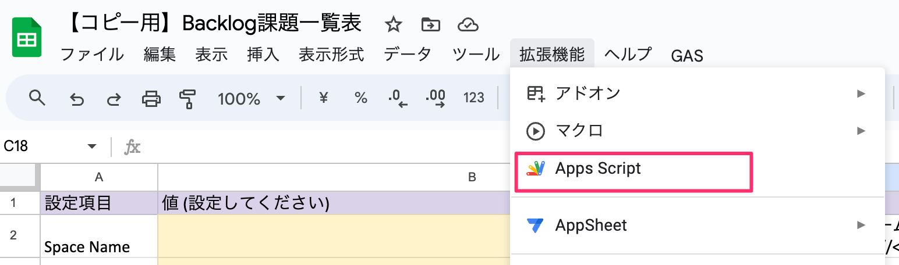
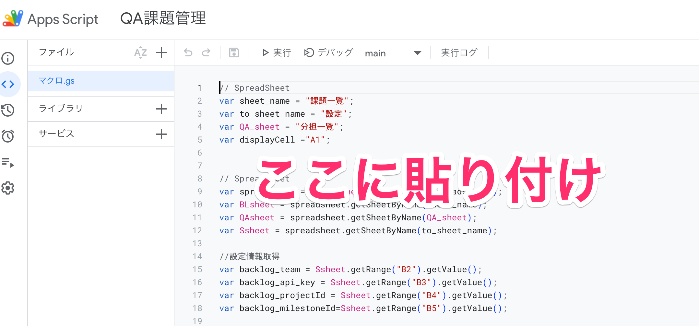
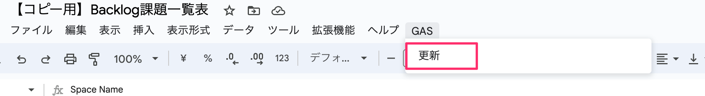

# Backlog課題一覧SpreadSheetの作り方

## 1. Google SpreadSheetを用意する

[こちらのシート](https://docs.google.com/spreadsheets/d/1ht_o7s2B7iw5VbWvQsn9EN6iZO_qs6PMjwBK5EQm_S4/edit?usp=sharing)をコピーしてご利用ください

大まかに、必要は設定は以下の通りです

- 以下３つのシートを作っておく
    - 「分担一覧」「設定」「課題一覧」
- 「設定」シートを以下のようにする
    - 
    - B2, B3, B4, B5セルに書く設定値を入れられる状態にすることが大事です

## 2. GoogleAppScriptにコードをコピペ
### 1. GoogleAppScriptエディタを開く

GoogleAppScriptのエディタを開きます

- 

### 2. コードをコピペ

以下のコードを全部コピーして、エディタ部分にまるごとコピーします

- 

#### コードはこちら

```javascript
// SpreadSheet
var sheet_name = "課題一覧";
var to_sheet_name = "設定";
var QA_sheet = "分担一覧";
var displayCell ="A1";


// SpreadSheet
var spreadsheet = SpreadsheetApp.getActiveSpreadsheet();
var BLsheet = spreadsheet.getSheetByName(sheet_name);
var QAsheet = spreadsheet.getSheetByName(QA_sheet);
var Ssheet = spreadsheet.getSheetByName(to_sheet_name);

//設定情報取得
var backlog_team = Ssheet.getRange("B2").getValue();
var backlog_api_key = Ssheet.getRange("B3").getValue();
var backlog_projectId = Ssheet.getRange("B4").getValue();
var backlog_milestoneId=Ssheet.getRange("B5").getValue();

var ProjectURL_view = "https://" + backlog_team + ".backlog.com/view/";

// 実行日時
var date = new Date();
var updateDate = (Utilities.formatDate( date, 'Asia/Tokyo', 'yyyy/MM/dd HH:mm:ss'));


/* --------------------------------------------------

  メイン

 -------------------------------------------------- */
function main(){
  
  //backlogリストの作成
  getBacklogList();

  //バックアップシートの削除
  DeleteSheets();

  //QAリストの作成
  setQAList();

  //一覧の整形
  listAlignment();

}

/* --------------------------------------------------

  バックアップシートの削除

 -------------------------------------------------- */
function DeleteSheets() {
 
  var sheet = spreadsheet.getActiveSheet();
 
  // 削除したくないシート名を配列で格納
  var sheets = ['分担一覧','設定','課題一覧'];
  
  var sheetcount = spreadsheet.getNumSheets();
  for(var i = sheetcount; i > 1; i--){ 
    
    var flag = true;  
    var sh = spreadsheet.getSheets()[i-1];　//アクティブなスプレッドシートに存在するシートを、[i-1]により配列の要素数で指定して取得し、変数shに代入
    
    for (var k=0; k<sheets.length; k++){ 
      if (sh.getName() == sheets[k]){
        flag = false;
        break;
      }
    }
   
    // 削除
    if (flag == true){
      spreadsheet.deleteSheet(sh);
    }
  }
}

/* --------------------------------------------------

  QA一覧を整列する

 -------------------------------------------------- */
function listAlignment(){

  //フィルタを解除してから処理する
  var settingFilter = QAsheet.getFilter();
  if (settingFilter) {
    settingFilter.remove();
  }

  const range = QAsheet.getRange("A1").getDataRegion();

  // 今日の日付を表示
  QAsheet.getRange("A1").setValue("更新日時\n" + updateDate);

  //フィルターの設定 FLG=1の時、非表示
  var criteria = SpreadsheetApp.newFilterCriteria().setHiddenValues(['1']).build();
  range.createFilter();
  QAsheet.getFilter().setColumnFilterCriteria(12, criteria);

  //ヘッダーカラー
  QAsheet.getRange("A1:L1").setBackgroundRGB(100,149,237);

  //状態ソート
  QAsheet.getFilter().sort(5, false); // 状態
  // QAsheet.getFilter().sort(6, true); // 優先度

  //条件付き書式の再設定
  const rules = QAsheet.getConditionalFormatRules();
  rules.push(SpreadsheetApp.newConditionalFormatRule().whenFormulaSatisfied('=$E1="完了"').setBackground("#CCCCCC").setRanges([range]).build());
  rules.push(SpreadsheetApp.newConditionalFormatRule().whenFormulaSatisfied('=$E1="処理済み"').setBackground("#D9EAD3").setRanges([range]).build());
  //rules.push(SpreadsheetApp.newConditionalFormatRule().whenFormulaSatisfied('=$E1="未対応"').setBackground("#F4CCCC").setRanges([range]).build());
  QAsheet.setConditionalFormatRules(rules);

}


/* --------------------------------------------------

  QA一覧をクリアする

 -------------------------------------------------- */
function clearList(){

  QAsheet.clear();

}


/* --------------------------------------------------

  QA一覧を更新する
  ※追記分は、キーに基づいて残しておく

 -------------------------------------------------- */
function setQAList(){

  // コピー元のシートを複製してリネーム
  let newSheet = QAsheet.copyTo(spreadsheet);
  newSheet.setName(backlog_milestoneId + ":" + updateDate);

  //フィルタを解除してから処理する
  var settingFilter = QAsheet.getFilter();
  if (settingFilter) {
    settingFilter.remove();
  }

  //其々データ取得する
  var BLdata = BLsheet.getRange("A1").getDataRegion().getValues();
  var Newdata = BLsheet.getRange("A1").getDataRegion().getValues(); //書き込み用
  var QAdata = QAsheet.getRange("A1").getDataRegion().getValues();

  //ヘッダーにQA情報列を追加する
  Newdata[0].push("進行担当","追加コメント","非表示FLG");


  //一致するものがあれば書き込む
  for(let i = 1; i < BLdata.length; i++) {

    //キーをハイパーリンクにする
    Newdata[i][0] = '=HYPERLINK(\"' + ProjectURL_view + BLdata[i][0] + '\",\"' +BLdata[i][0]+'\")';

    //QA項目要素を３つ追加しておく(0=表示、1=非表示)
    Newdata[i].push("","",0);

    //QA入力欄要素を確保する
    for(let j = 1; j < QAdata.length; j++) {

      //backlogとQA一覧が一致するもの
      if(BLdata[i][0] == QAdata[j][0]){

        //進行担当
        if(QAdata[j][9].length >0){
          Newdata[i][9] = QAdata[j][9];
        }
        //コメント
        if(QAdata[j][10].length>0){
          Newdata[i][10] = QAdata[j][10];
        }
        //FLGが1の時に転記
        if(QAdata[j][11]>0){
          Newdata[i][11] = QAdata[j][11];
        }
        
      }
    
    }

  }


  //QA一覧にあって、backlogにないもの(削除かマイルストーン変更)は履歴として一覧へ追加する
  var cnt=0;
  for(let j = 1; j < QAdata.length; j++) {

    for(let i = 1; i < BLdata.length; i++) {
      if(QAdata[j][0] == BLdata[i][0]){
        cnt = 1; //一覧にあったら1
      }
    }

    //backlogに存在？
    if(cnt == 1){
      cnt = 0;　//存在したらカウンタ戻す
    }else{
      QAdata[j][0] = '=HYPERLINK(\"' + ProjectURL_view + QAdata[j][0] + '\",\"' +QAdata[j][0]+'\")';
      QAdata[j][8] = "変更"; //コメントつけて
      QAdata[j][11] = 1;      //非表示フラグをつけて
      Newdata.push(QAdata[j]);//一覧へ追加する
    }

  }


  //消してから書き込み
  QAsheet.clear();
  QAsheet.getRange(1,1,Newdata.length,Newdata[0].length).setValues(Newdata);

  //console.log("全件数 " + Newdata.length);

}


/* --------------------------------------------------

  Backlogから指定のマイルストーンを取得する

 -------------------------------------------------- */
function getBacklogList() {

  //リストをクリアする
  BLsheet.clear();

  //1行目はタイトル
  BLsheet.getRange(1, 1).setValue("キー");
  BLsheet.getRange(1, 2).setValue("種別");
  BLsheet.getRange(1, 3).setValue("カテゴリ名");
  BLsheet.getRange(1, 4).setValue("件名");
  BLsheet.getRange(1, 5).setValue("状態");
  BLsheet.getRange(1, 6).setValue("優先度");
  BLsheet.getRange(1, 7).setValue("担当者");
  BLsheet.getRange(1, 8).setValue("起票者");
  BLsheet.getRange(1, 9).setValue("マイルストーン");

  //APIの仕様で100件ずつしか取得できないので、offsetにより全件取得
  var offset = 0;//backlogのAPI仕様
  var loop = true;
  while (loop) {

    //backlog Apiからデータ取得
    let api = "https://" + backlog_team + 
                  ".backlog.com/api/v2/issues?apiKey=" + backlog_api_key + 
                  "&projectId[]=" + backlog_projectId + 
                  "&count=100" +
                  "&offset=" + offset; //課題が100件以上ある場合に、分割して取得
    if (backlog_milestoneId) {
      api += "&milestoneId[]=" + backlog_milestoneId;
    }
    var response = UrlFetchApp.fetch(api);
    var issue_list = JSON.parse(response.getContentText());

    //2行目から書き込み開始
    var range = 2 + offset;
    for (let i = 0; i < Object.keys(issue_list).length; i++) {
      const issue = issue_list[i];
      BLsheet.getRange(i + range, 1).setValue(issue.issueKey);
      BLsheet.getRange(i + range, 2).setValue(issue.issueType.name);
      for (let j = 0; j < issue.category.length; j++) { 
        BLsheet.getRange(i + range, 3).setValue(issue.category[j].name);
      }
      BLsheet.getRange(i + range, 4).setValue(issue.summary);
      BLsheet.getRange(i + range, 5).setValue(issue.status.name);
      BLsheet.getRange(i + range, 6).setValue(issue.priority.name);
      BLsheet.getRange(i + range, 7).setValue(issue.assignee ? issue.assignee.name : "");//未設定時の三項演算子
      BLsheet.getRange(i + range, 8).setValue(issue.createdUser.name);
      BLsheet.getRange(i + range, 9).setValue(issue.milestone && issue.milestone[0] ? issue.milestone[0].name : "");//未設定時の三項演算子
      
    }

    //100件の時は継続して取得処理へ
    if (Object.keys(issue_list).length == 100) {
        offset += 100;
    } else {
        loop = false;
    }

  }
}


/* --------------------------------------------------

  スプレッドシートにメニュー表示する

 -------------------------------------------------- */
function onOpen() {
  
  let ui = SpreadsheetApp.getUi();
  let menu = ui.createMenu("GAS");
  menu.addItem("更新","main");
  menu.addToUi();

}
```

## 3. 設定を入力

「設定」シートに、各種設定値を入力します。

- 

| 設定項目 | 説明 | 必須 |
| --- |  --- | -- |
| Space Name | スペースネーム <br>URLの https://<ここの部分>.backlog.com/ | 必須 |
| API Key | API Key<br>こちらのリンクを参照 https://support-ja.backlog.com/hc/ja/articles/360035641754-API%E3%81%AE%E8%A8%AD%E5%AE%9A | 必須 |
| Project ID |  対象プロジェクトのProject ID | 必須 |
| milestone ID |  対象のマイルストーンID。マイルストーンで絞らない場合は空欄にする | |


## 4. 実行

メニューバーのGAS=>更新 ボタンより、実行します。

- 